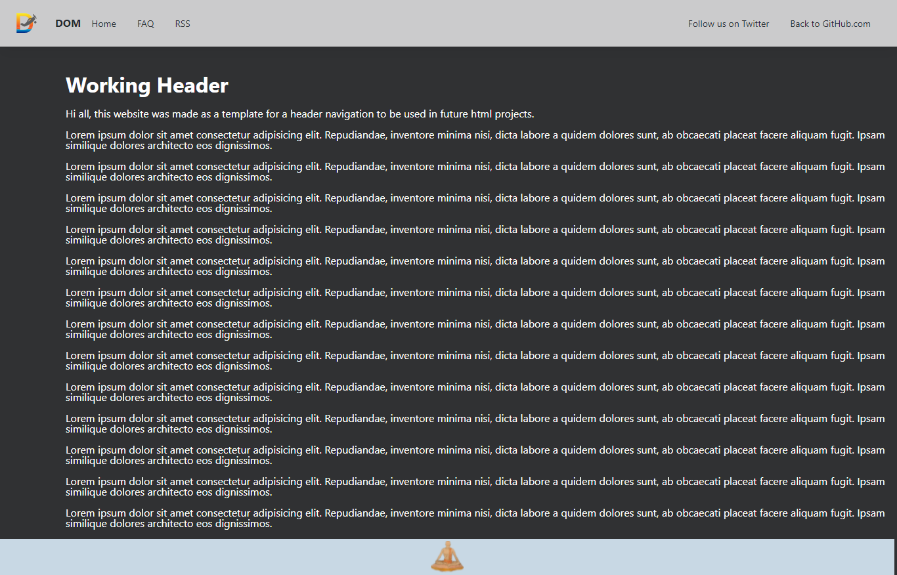

# header-template

## Assignment

The goal of this assignment was to create a basic sticky header to act as a template for future html projects.

The above is a screen capture of the header that I created.

 

A link to the webpage that I made can be found in the About section of this repository or below.

https://header-template-dommitchell.netlify.app/
